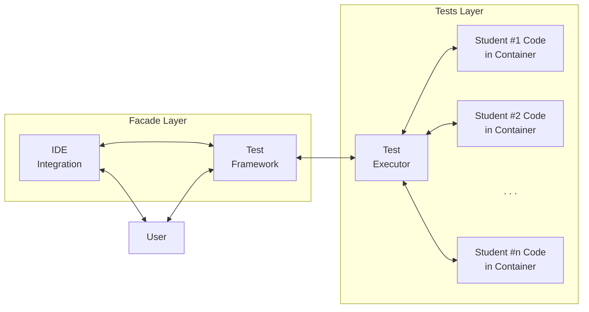
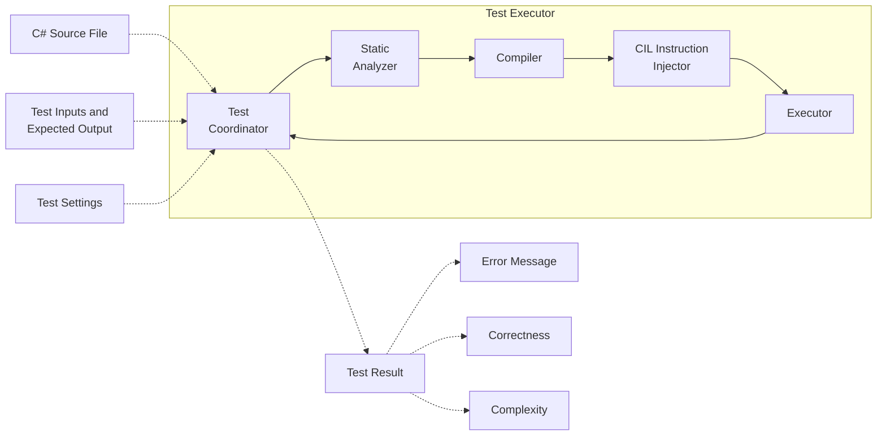

# Architecture

> This is just a sketch -- it can change over time.

## Graphs

### System Overview



### Test Executor Flow



## Tech stack

* .NET 10
* Docker

### Test Framework / IDE Integration

* [xUnit](https://xunit.net/?tabs=cs)/[MSTest](https://learn.microsoft.com/en-us/dotnet/core/testing/unit-testing-csharp-with-mstest) wrapper -- IDE integration and much testing machinery for free; the only thing left to build is test-code generator (probably)
* [Microsoft.Testing.Platform](https://learn.microsoft.com/en-us/dotnet/core/testing/microsoft-testing-platform-intro) -- creating test framework from scratch; building only what's needed

### Test Executor

#### Static Analyzer
* [Syntax API (Roslyn)](https://learn.microsoft.com/en-us/dotnet/csharp/roslyn-sdk/get-started/syntax-analysis)

#### Compiler
* [Roslyn](https://www.tugberkugurlu.com/archive/compiling-c-sharp-code-into-memory-and-executing-it-with-roslyn) -- state-of-the-art for dynamic code compilation
* [CodeDOM](https://learn.microsoft.com/en-us/dotnet/framework/reflection-and-codedom/dynamic-source-code-generation-and-compilation) -- old and not recommended

#### CIL Instruction Injector
* [Mono Cecil](https://www.mono-project.com/docs/tools+libraries/libraries/Mono.Cecil/)

#### Executor
* [Testcontainers](https://testcontainers.com/)
* [dotnet-runtime Docker Image](https://hub.docker.com/r/microsoft/dotnet-runtime) -- normal or [distroless](https://github.com/dotnet/dotnet-docker/blob/main/documentation/distroless.md) version

## Facade

> Conceptinal facade -- will change, probably.

```cs
// usings, namespaces, ...

[SolutionList(...)] // list of student id-their code pairs 
[TestCase(...)] // test case with (potentially) a couple of input volumes
[TestCase(...)]
public partial class Lab1Evaluation { }
```
