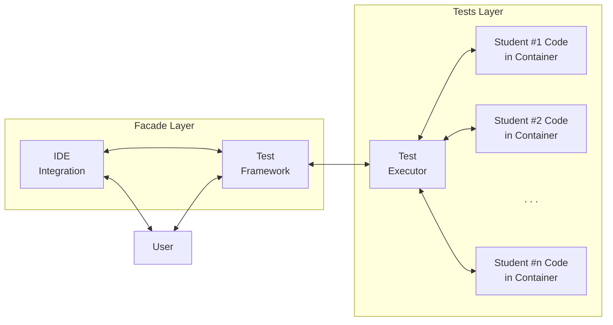
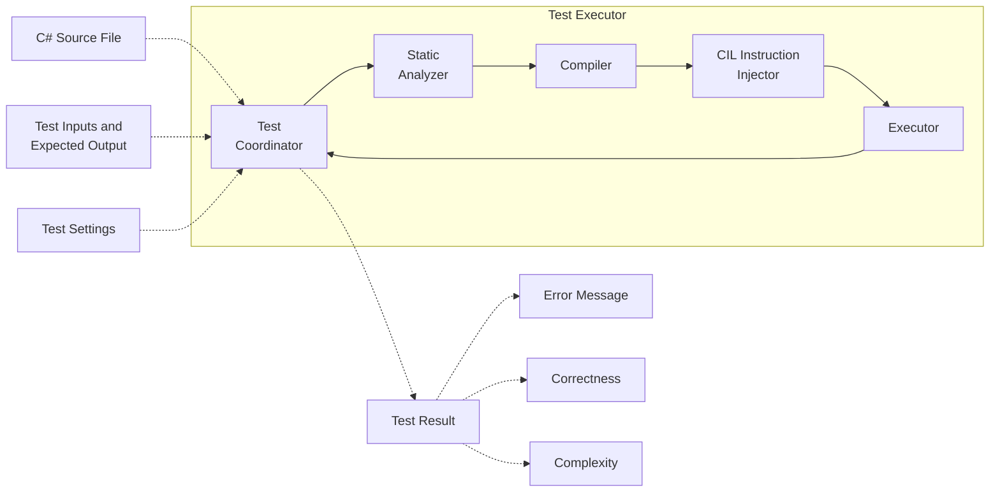

# Architecture

> This is just a sketch -- it can change over time.

## Graphs

### System Overview

### Test Executor Flow

# Tech stack

* .NET 10
* Docker

## Test Framework / IDE Integration

* [Microsoft.Testing.Platform](https://learn.microsoft.com/en-us/dotnet/core/testing/microsoft-testing-platform-intro)

## Test Executor

* [Testcontainers](https://testcontainers.com/)
* [Mono Cecil](https://www.mono-project.com/docs/tools+libraries/libraries/Mono.Cecil/)
